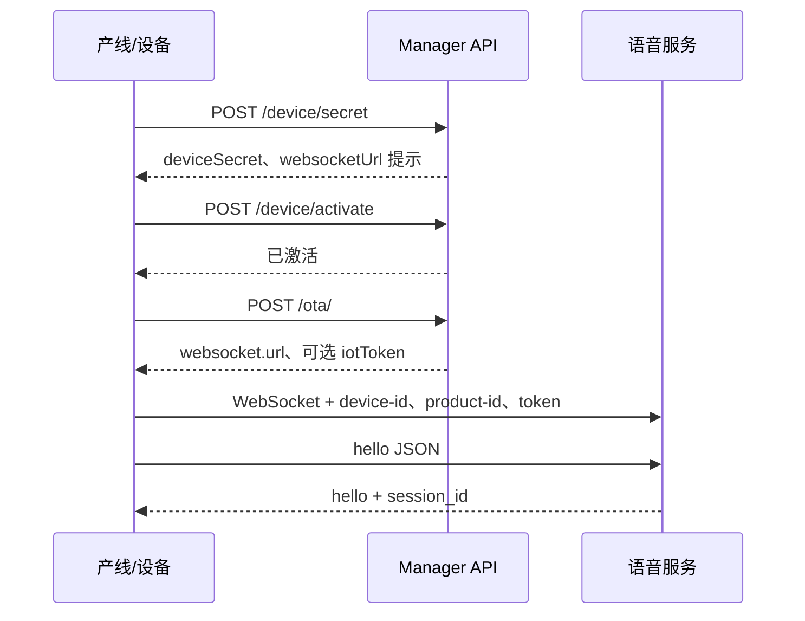

## 本文档的用途

本文档面向 **硬件厂商、嵌入式 / 固件工程师及产线工具开发者**，说明如何把自有设备接到 **WhalesBot AI** 平台：在 **鲸鱼 AI 智控平台** 完成应用与设备准备后，通过 **manager-api** 完成密钥签发与激活，再通过 **WebSocket** 连接语音服务，实现握手、上行音频与下行合成等实时交互。

阅读并按章节顺序落地后，你可独立完成：**工厂签发 DeviceSecret → 设备激活（含按需用户绑定）→ OTA 获取连接参数 → 建立语音会话**。**设备绑定**一章补充了 **OTA 请求体字段**、**HTTP/OTA 错误形态**、**强制绑定与 `userUuid`**、**环境与 `factoryToken`**；**设备连接**与 **WebSocket 消息协议** 补充 **Header 鉴权**、**二进制音频与重连**。文档聚焦 **对接契约与推荐流程**，不涉及智控台界面逐步截图（以控制台实际菜单为准）。

<Note>
  本文档 **仅覆盖「设备接入」**：匿名 HTTP 绑定接口与语音网关 WebSocket 协议。**不包含**开放云的 Chat / TTS / ASR HTTP API 等能力与计费说明；若后续产品线扩展，将以独立章节或站点另行发布。
</Note>

---

WhalesBot 为 OEM 固件与产线工具提供 **两条主线流程**：**设备绑定**（HTTP）→ **设备连接**（建连与二进制音频）；交互用的 **文本 JSON** 见 **[WebSocket 消息协议](/websocket-protocol)**，便于第三方抓包对账。

## 接入路径

<CardGroup cols={2}>
  <Card title="设备绑定" icon="link" href="/device-binding">
    产线下发：**签发 DeviceSecret**、**激活**设备、调用 **OTA** 获取连接参数（`websocket.url`、可选 `iotToken`）。
  </Card>
  <Card title="设备连接" icon="bolt" href="/device-connection">
    使用设备标识与可选 Bearer token 建立 **WebSocket**，在 `hello` 握手后交换 JSON 控制帧与二进制音频。
  </Card>
</CardGroup>

<CardGroup cols={1}>
  <Card title="WebSocket 消息协议" icon="code" href="/websocket-protocol">
    文本帧 **JSON** 格式约定、`hello` / `listen` / `stt` / `tts` 等示例与联调顺序 — 供抓包与对账。
  </Card>
</CardGroup>

## 智控台环境地址

开发拼接跳转链接、配置客户端「打开控制台」等场景时，使用与当前业务环境一致的 **Base URL**（路径前不要再重复拼接域名）：

| 环境 | 智控台 Base URL |
|------|----------------|
| **测试** | `https://test-whalesbotai-console.whalesbot.com/` |
| **生产** | `https://prod-whalesbotai-console.whalesbot.com/` |

示例：在测试环境打开智控台某功能页时，使用 **测试环境 Base URL** 作为 origin，再拼接该环境前端的路由路径（pathname / hash 以智控台实际工程为准）。

<Note>
  **manager-api**（设备匿名接口）、**OTA 返回的语音 WebSocket** 等域名由运维与集群配置下发，**不一定**与上表域名相同；设备 HTTP/OTA 请以对接邮件与环境说明为准，勿直接把智控台域名当作 API Host。
</Note>

## 前置条件

- **控制台**：创建**应用**（`productId`）、录入设备；**ProductSecret** 取自智控台 **应用中心 → 我的应用 → 修改应用** 页中的 **应用 Secret**（与文档字段同名对应）。用于工厂签名时请按贵司安全策略保管，勿写入可向用户导出的固件明文。
- **Base URL**：下文 HTTP 路径均相对于已部署的 **manager-api** 源站（若网关挂在 `/whalesbotai` 等前缀下，请自行拼接）。环境划分见上表及 [设备绑定](/device-binding) 中的「部署环境与访问地址」。

## 端到端时序

<Tip>
  若应用启用**强制用户绑定**，激活时必须携带 `userUuid`；在此模式下 OTA 会拒绝**未绑定用户**的设备。
</Tip>
